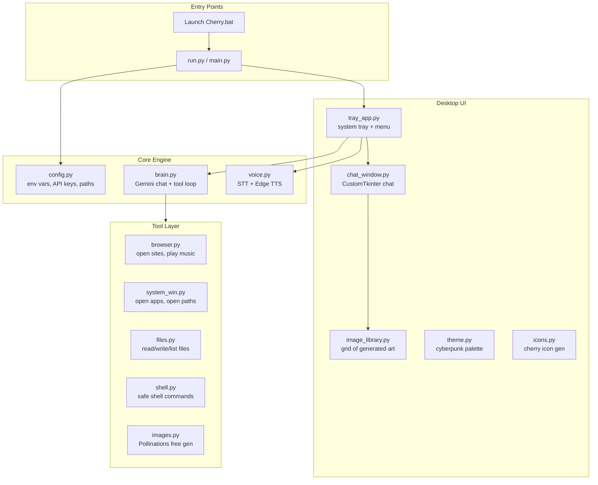
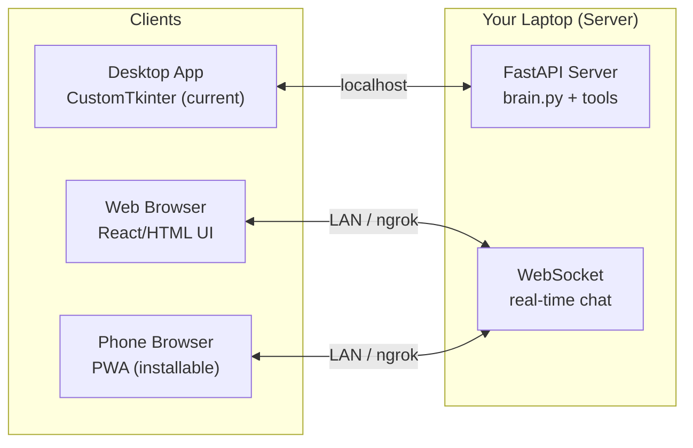

# 🍒 Cherry AI — Full Project Analysis & Roadmap

---

## 1. Architecture Overview — What You've Built



### Current Stack

| Layer | Technology | Cost |
|-------|-----------|------|
| AI Brain | Gemini 2.5 Flash (free tier) | **$0** |
| Voice STT | Google Speech Recognition | **$0** |
| Voice TTS | Edge TTS (JennyNeural) | **$0** |
| Image Gen | Pollinations.ai | **$0** |
| Desktop UI | CustomTkinter (cyberpunk theme) | **$0** |
| System Tray | pystray | **$0** |
| Desktop App | Python + .bat launcher | **$0** |

---

## 2. Feature Inventory — What Works Today

### ✅ Working Features

| Feature | Status | Files |
|---------|--------|-------|
| Gemini chat (text) | ✅ Solid | [brain.py](file:///k:/THE%20PROJECTS/CherryAI/cherry/brain.py) |
| Multi-key fallback (quota rotation) | ✅ Smart | [brain.py](file:///k:/THE%20PROJECTS/CherryAI/cherry/brain.py#L135-L176), [config.py](file:///k:/THE%20PROJECTS/CherryAI/cherry/config.py#L34-L45) |
| Multi-model fallback | ✅ Smart | [config.py](file:///k:/THE%20PROJECTS/CherryAI/cherry/config.py#L51-L60) |
| Voice input (STT) | ✅ Works | [voice.py](file:///k:/THE%20PROJECTS/CherryAI/cherry/voice.py#L74-L87) |
| Voice output (TTS) | ✅ Works | [voice.py](file:///k:/THE%20PROJECTS/CherryAI/cherry/voice.py#L94-L124) |
| Always-listen / Wake word modes | ✅ Works | [voice.py](file:///k:/THE%20PROJECTS/CherryAI/cherry/voice.py#L126-L173) |
| Open websites (named + URLs) | ✅ Works | [browser.py](file:///k:/THE%20PROJECTS/CherryAI/cherry/tools/browser.py) |
| Open Windows apps | ✅ Works | [system_win.py](file:///k:/THE%20PROJECTS/CherryAI/cherry/tools/system_win.py) |
| Open folders / files | ✅ Works | [system_win.py](file:///k:/THE%20PROJECTS/CherryAI/cherry/tools/system_win.py#L52-L63) |
| Play music (YouTube links) | ✅ Basic | [browser.py](file:///k:/THE%20PROJECTS/CherryAI/cherry/tools/browser.py#L31-L38) |
| Read/write files | ✅ Works | [files.py](file:///k:/THE%20PROJECTS/CherryAI/cherry/tools/files.py) |
| List directories | ✅ Works | [files.py](file:///k:/THE%20PROJECTS/CherryAI/cherry/tools/files.py#L51-L64) |
| Run safe shell commands | ✅ Works | [shell.py](file:///k:/THE%20PROJECTS/CherryAI/cherry/tools/shell.py) |
| Generate images (Pollinations) | ✅ Works | [images.py](file:///k:/THE%20PROJECTS/CherryAI/cherry/tools/images.py) |
| Image library gallery | ✅ Works | [image_library.py](file:///k:/THE%20PROJECTS/CherryAI/cherry/ui/image_library.py) |
| System tray icon | ✅ Works | [tray_app.py](file:///k:/THE%20PROJECTS/CherryAI/cherry/ui/tray_app.py) |
| Stop / cancel mid-response | ✅ Works | [brain.py](file:///k:/THE%20PROJECTS/CherryAI/cherry/brain.py#L105-L113) |
| Cyberpunk dark theme | ✅ Nice | [theme.py](file:///k:/THE%20PROJECTS/CherryAI/cherry/ui/theme.py) |
| Crash logging | ✅ Works | [run.py](file:///k:/THE%20PROJECTS/CherryAI/run.py#L14-L19) |
| Desktop shortcut installer | ✅ Works | `install_desktop_shortcut.ps1` |
| Destructive command blocking | ✅ Works | [shell.py](file:///k:/THE%20PROJECTS/CherryAI/cherry/tools/shell.py#L7-L11) |
| Path sandboxing | ✅ Works | [files.py](file:///k:/THE%20PROJECTS/CherryAI/cherry/tools/files.py#L8-L19) |

> [!TIP]
> **Honest assessment**: You've built a surprisingly complete and well-structured desktop assistant. The multi-key rotation, model fallback, and safety sandboxing are genuinely smart design decisions. This is a solid foundation.

---

## 3. What's Missing — Feature Gap Analysis

### 🔴 Critical (Must-Have for "Jarvis-Level")

| # | Missing Feature | Why It Matters | Difficulty |
|---|----------------|----------------|------------|
| 1 | **Cross-platform mobile app** | You said laptop + phone — right now it's Windows-only desktop | 🔴 Hard |
| 2 | **Persistent conversation memory** | History is lost every restart. Jarvis remembers things. | 🟡 Medium |
| 3 | **Context-aware file editing** | `write_file` overwrites entire files — no "edit line 42" capability | 🟡 Medium |
| 4 | **Streaming responses** | Entire response loads at once — feels laggy on long answers | 🟡 Medium |
| 5 | **Markdown rendering in chat** | Code blocks, bold, lists all render as plain text | 🟡 Medium |

### 🟡 Important (Professional-Level Quality)

| # | Missing Feature | Why It Matters | Difficulty |
|---|----------------|----------------|------------|
| 6 | **Web search tool** | Can't look up current info, weather, news | 🟢 Easy |
| 7 | **Clipboard integration** | Can't read/write clipboard — common assistant task | 🟢 Easy |
| 8 | **Screenshot capture** | Can't see what's on screen — limits "help me" scenarios | 🟢 Easy |
| 9 | **System info tool** | Can't report CPU, RAM, disk, battery, Wi-Fi | 🟢 Easy |
| 10 | **Timer / reminder / alarm** | Basic assistant expectations | 🟡 Medium |
| 11 | **Keyboard shortcuts** | No global hotkey to summon Cherry | 🟢 Easy |
| 12 | **Chat export / search** | Can't search past conversations | 🟡 Medium |
| 13 | **Multi-file code generation** | Generates code but can't scaffold entire projects | 🟡 Medium |
| 14 | **Error recovery in voice loop** | Mic errors can silently kill the voice thread | 🟢 Easy |
| 15 | **Notification system** | No way to alert you outside the chat window | 🟢 Easy |

### 🟢 Nice-to-Have (Polished Experience)

| # | Missing Feature | Why It Matters | Difficulty |
|---|----------------|----------------|------------|
| 16 | **Conversation tabs / sessions** | Single conversation stream gets messy | 🟡 Medium |
| 17 | **Plugin / extension system** | Adding new tools requires editing source code | 🟡 Medium |
| 18 | **Voice cloning / custom voices** | Personalization — sounds more "yours" | 🟢 Easy (just change VOICE in .env) |
| 19 | **Smart home integration** | Control lights, switches via local APIs | 🔴 Hard |
| 20 | **Auto-update mechanism** | No way to update Cherry remotely | 🟡 Medium |

---

## 4. Cross-Platform Strategy (Laptop + Phone — $0 Budget)

This is your biggest architectural challenge. Here are the realistic options:

### Option A: Web App + API Server (⭐ Recommended)



**How it works:**
1. Your laptop runs a FastAPI server exposing Cherry's brain + tools over WebSocket
2. The current CustomTkinter app connects to `localhost`
3. Your phone opens a Progressive Web App (PWA) in the browser — same UI, installable
4. On the same Wi-Fi? Connect directly. Outside home? Use **ngrok** (free tier) or **Cloudflare Tunnel** (free)

**Cost: $0** — FastAPI is free, ngrok free tier gives you a public URL, PWA is just HTML/JS

### Option B: Telegram Bot (Easiest, Phone + Laptop)

- Use **python-telegram-bot** (free) — Cherry responds in Telegram
- Works on phone + desktop instantly
- No hosting cost — your laptop is the server
- Loses rich UI but gains cross-platform instantly

### Option C: Flutter / React Native Mobile App

- Full native app experience
- **Way too much work for one person** right now
- Needs backend API anyway (so you'd still need Option A first)
- ❌ Skip this for now

> [!IMPORTANT]
> **My recommendation:** Start with **Option A** (FastAPI + PWA). It gives you laptop + phone with zero cost, and the web UI can be made to look just as good as your desktop app. The current CustomTkinter app stays as-is for desktop use.

---

## 5. Issues You Will Face & How to Tackle Them

### Issue 1: Gemini Free Tier Quota Exhaustion
**Problem:** Heavy use will hit rate limits (15 RPM, 1500 RPD for flash).  
**Symptoms:** "RESOURCE_EXHAUSTED" errors even with fallback models.

**Solutions:**
- ✅ You already have multi-key rotation — **excellent**
- Add response caching (same question within 5 min → return cached answer)
- Create 3-4 Google accounts for API keys (each gets its own quota)
- Use `gemini-2.0-flash-lite` for simple tasks (cheaper quota), reserve `2.5-flash` for coding

### Issue 2: Voice Recognition Accuracy
**Problem:** Google STT free tier has mediocre accuracy, especially with accents or background noise.  
**Symptoms:** Misheard commands, wrong words, missed wake words.

**Solutions:**
- Switch to **Whisper** (OpenAI's free, local model via `openai-whisper` or `faster-whisper` package) — runs offline, much more accurate
- Add a confirmation step for critical commands: "I heard 'delete all files.' Confirm?"
- Implement noise gate: skip STT if audio energy is below threshold

### Issue 3: TTS Truncation at 500 Characters
**Problem:** [voice.py line 106](file:///k:/THE%20PROJECTS/CherryAI/cherry/voice.py#L106) — long responses are cut to 500 chars.  
**Impact:** Complex coding explanations get chopped mid-sentence.

**Solutions:**
- Split response into sentences, speak each as a separate TTS segment
- Or let the user choose: "Read full response" vs "Read summary"

### Issue 4: History Lost on Restart
**Problem:** `self._contents` in Brain is an in-memory list — gone when Cherry closes.  
**Impact:** Cherry forgets everything between sessions. Not very Jarvis.

**Solutions:**
- Save history to a local JSON/SQLite file on every exchange
- Load last N messages on startup
- Add a "memory" system: Cherry stores key facts about you (`user likes dark mode`, `projects: CherryAI, CodeSpawn`)

### Issue 5: No Internet = No Cherry
**Problem:** Gemini, Pollinations, Google STT, Edge TTS all need internet.  
**Impact:** Cherry is a brick offline.

**Solutions (partial, all free):**
- **Offline STT:** Use `faster-whisper` (runs locally, ~1GB model)
- **Offline TTS:** Use `pyttsx3` as fallback (sounds worse but works offline)
- **Offline AI:** Use `ollama` with a small model like `phi-3-mini` or `gemma-2b` — your laptop can run these
- Keep Gemini as primary when online, fall back to local model when offline

### Issue 6: Shell Command Security
**Problem:** The blocklist approach in [shell.py](file:///k:/THE%20PROJECTS/CherryAI/cherry/tools/shell.py#L7-L11) is a blacklist — clever attackers can bypass it.  
**Example:** `powershell -c "Remove-Item -Recurse C:\"` isn't explicitly blocked.

**Solutions:**
- Switch to an **allowlist-only approach** (you partially have this with `_ALLOWED_PREFIXES`)
- Add a confirmation prompt for any command that writes/deletes
- Log all executed commands to a file for audit

### Issue 7: CustomTkinter Limitations
**Problem:** CustomTkinter can't render markdown, code highlighting, or rich media well.  
**Impact:** Code responses look like plain text. No syntax highlighting, no copy buttons.

**Solutions:**
- For desktop: switch to **webview** (`pywebview` package) — embed a real HTML/CSS/JS UI inside a desktop window
- For the web/phone path: use a React frontend with proper markdown rendering
- Both approaches: zero cost

### Issue 8: Image Generation Quality
**Problem:** Pollinations quality is inconsistent and slow (sometimes 30+ seconds).  
**Impact:** User experience suffers during image generation.

**Solutions:**
- Add a progress indicator ("Generating image, this may take 30-60 seconds...")
- Cache generated images by prompt hash (don't re-generate the same prompt)
- Consider **Stable Diffusion via Hugging Face Inference API** (free tier: rate-limited but higher quality)

### Issue 9: Temp File Cleanup for TTS
**Problem:** [voice.py line 107](file:///k:/THE%20PROJECTS/CherryAI/cherry/voice.py#L107) creates temp MP3s. The `finally` block tries to delete them but `OSError` is silently caught.  
**Impact:** Over time, hundreds of orphaned MP3 files accumulate in the temp directory.

**Solutions:**
- Reuse a single temp file path instead of timestamped names
- Add a cleanup-on-startup routine that deletes old `cherry_tts_*.mp3` files

### Issue 10: Thread Safety in Chat
**Problem:** The `_contents` list in Brain is mutated from multiple threads (voice thread + UI thread) without a lock.  
**Impact:** Rare but possible: corrupted conversation history, crashes.

**Solutions:**
- Add a `threading.Lock()` around all `_contents` mutations
- Or use a `queue.Queue` for incoming messages

---

## 6. Phased Roadmap — What to Build Next

### Phase 1: Stability & Quick Wins (1-2 weeks)

These require minimal code changes and dramatically improve the experience:

| Task | Impact | Effort |
|------|--------|--------|
| Add `threading.Lock` to Brain._contents | Prevents race condition crashes | 30 min |
| Persistent chat history (JSON file) | Cherry remembers across restarts | 2 hours |
| Global hotkey to summon Cherry (e.g., `Ctrl+Shift+C`) | Instant access | 1 hour |
| Web search tool (DuckDuckGo API, free) | Answer current-events questions | 1 hour |
| Clipboard read/write tool | "Copy this to clipboard" | 30 min |
| System info tool (CPU, RAM, battery) | "How much RAM am I using?" | 1 hour |
| Fix TTS truncation (split into sentences) | Full responses spoken aloud | 1 hour |
| Clean up temp TTS files on startup | No more orphaned MP3s | 30 min |
| Add streaming responses (Gemini supports this) | Messages appear word-by-word | 2 hours |

### Phase 2: Cross-Platform (2-4 weeks)

| Task | Impact | Effort |
|------|--------|--------|
| Build FastAPI WebSocket server wrapping Brain | Backend for all clients | 1 day |
| Build web-based chat UI (HTML/CSS/JS PWA) | Works on phone + any browser | 2-3 days |
| Add ngrok / Cloudflare Tunnel auto-setup | Access Cherry from anywhere | 2 hours |
| Keep CustomTkinter app as desktop client | Desktop users unaffected | 0 (already done) |
| Make PWA installable on phone | Feels like a native app | 1 hour |

### Phase 3: Intelligence Upgrades (2-4 weeks)

| Task | Impact | Effort |
|------|--------|--------|
| User memory system (Cherry remembers facts about you) | "You told me your birthday is..." | 1 day |
| Offline fallback with Ollama | Works without internet | 1 day |
| Switch STT to Whisper (local, better accuracy) | Fewer misheard commands | 2 hours |
| Markdown rendering in chat (HTML via webview or web UI) | Beautiful code blocks | 1 day |
| Screenshot + describe tool | "What's on my screen?" | 2 hours |
| Timer / reminder system | "Remind me in 30 minutes" | 3 hours |

### Phase 4: Professional Polish (2-4 weeks)

| Task | Impact | Effort |
|------|--------|--------|
| Conversation tabs / sessions | Organized chat history | 1 day |
| Chat search ("find when I asked about X") | Find past conversations | 3 hours |
| Plugin system (drop .py files in a folder) | Easy to add new tools | 1 day |
| Settings UI (change voice, model, paths in-app) | No more editing .env manually | 1 day |
| Auto-update from GitHub releases | Stay current | 3 hours |
| Notification system (Windows toast + push to phone) | Alerts for reminders/tasks | 1 day |

---

## 7. Free Tools & Services You'll Need

| Tool | Purpose | Cost |
|------|---------|------|
| [Gemini API](https://aistudio.google.com/apikey) | AI brain | Free tier |
| [Pollinations.ai](https://pollinations.ai/) | Image generation | Free |
| [Edge TTS](https://pypi.org/project/edge-tts/) | Text-to-speech | Free |
| [FastAPI](https://fastapi.tiangolo.com/) | Backend server | Free |
| [ngrok](https://ngrok.com/) | Public URL for phone access | Free tier |
| [Cloudflare Tunnel](https://developers.cloudflare.com/cloudflare-one/connections/connect-networks/) | Alternative to ngrok | Free |
| [Ollama](https://ollama.ai/) | Offline AI models | Free |
| [faster-whisper](https://github.com/SYSTRAN/faster-whisper) | Offline STT | Free |
| [DuckDuckGo Instant Answer API](https://api.duckduckgo.com/) | Web search | Free |
| [Hugging Face Inference API](https://huggingface.co/inference-api) | Better image gen (optional) | Free tier |

---

## 8. Code Quality Issues to Fix Now

### Bug: Race Condition in `brain.py`
```python
# brain.py — _contents is accessed from multiple threads without synchronization
# FIX: Add a lock
class Brain:
    def __init__(self):
        ...
        self._lock = threading.Lock()
    
    def chat(self, ...):
        with self._lock:
            self._contents.append(...)
```

### Bug: Music Library Import is Fragile
```python
# browser.py line 3 — imports from project root, will break if CWD changes
import musicLibrary  # ← fragile, depends on sys.path including project root

# FIX: Use relative import or move musicLibrary into cherry package
from cherry.tools._music_data import music
```

### Bug: `open_path` Has No Sandboxing
```python
# system_win.py — open_path doesn't check ALLOWED_PATHS!
# It will open ANY path on the system, bypassing your security model
def open_path(path: str) -> str:
    # FIX: Add the same _resolve_allowed check from files.py
```

### Improvement: Shell Blocklist Can Be Bypassed
```python
# shell.py — "powershell -c 'Remove-Item ...'" bypasses the blocklist
# because _BLOCKED doesn't catch powershell cmdlets wrapped in -c
# FIX: Also block "powershell -c", "pwsh -c", "cmd /c" patterns
```

---

## 9. Estimated Total Timeline

| Phase | Duration | What You Get |
|-------|----------|-------------|
| Phase 1: Stability | 1-2 weeks | Rock-solid desktop assistant |
| Phase 2: Cross-Platform | 2-4 weeks | Works on phone + laptop |
| Phase 3: Intelligence | 2-4 weeks | Remembers you, works offline, great voice |
| Phase 4: Polish | 2-4 weeks | Professional-grade, extensible, auto-updating |
| **Total** | **7-14 weeks** | **Full Jarvis-level assistant, $0 spent** |

---

## 10. Summary

> [!NOTE]
> **Bottom line**: Cherry AI already has a remarkably solid foundation — the multi-key/multi-model fallback system, tool sandboxing, voice control, and cyberpunk UI are genuinely good engineering. You're about 40% of the way to a professional personal assistant.

**The three biggest gaps are:**
1. **Cross-platform** (phone access) — solve with FastAPI + PWA
2. **Memory/persistence** — solve with local JSON/SQLite storage
3. **Rich UI rendering** — solve by moving to a web-based UI (webview or PWA)

All solvable at **$0 cost**. Tell me which phase you want to start with and I'll write the code.
